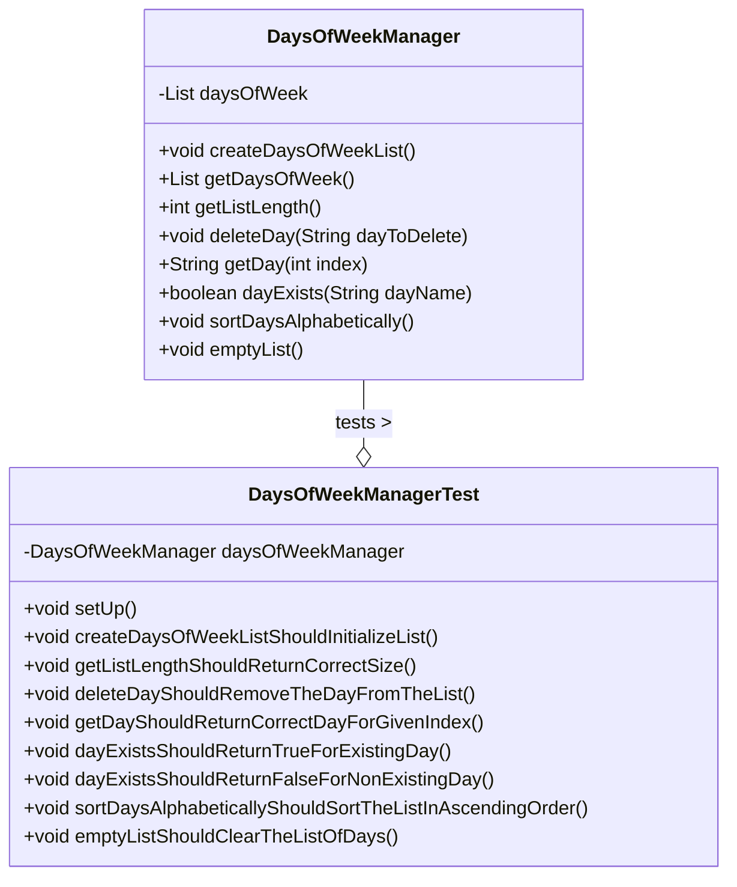

🥷 Days of the Week Manager
================================================

This exercise is a Java application that implements a class to manage
a list of the days of the week. It focuses on practicing core Java
concepts, Object-Oriented Programming ([OOP](https://en.wikipedia.org/wiki/Object-oriented_programming)),
and modern software development methodologies like Test-Driven Development
([TDD](https://en.wikipedia.org/wiki/Test-driven_development)).

🚀 Technologies Used
--------------------
*   **Java 21**: The primary programming language used for this exercise.
*   **Maven**: A build automation tool used to manage dependencies and lifecycle.
*   **JUnit 5**: The testing framework used for writing and running unit tests.
*   **Hamcrest**: A library of matcher objects that can be combined to create flexible and readable assertions in tests.
*   **Git & GitHub**: Version control system and hosting platform used to manage the exercise's codebase.
*   **Visual Studio Code and IntelliJ IDEA**: These are the integrated development environments (IDEs) used for development.

✨ Features and Requirements
---------------------------
The ```DaysOfWeekManager``` class was developed to meet the following requirements:
All methods are unit tested using JUnit 5 and Hamcrest, with the List collection
from java.util being used as required.

🧠 Key Learnings and Important Concepts
---------------------------------------
This exercise provides an excellent opportunity to reinforce several fundamental concepts in software development:

### TDD (Test-Driven Development) Cycle
The project was developed following the TDD workflow:

1.  **Red**: Write a failing test for a new feature.
2.  **Green**: Write the minimum amount of code required to make the test pass.
3.  **Refactor**: Improve the code (e.g., readability, efficiency, and documentation) while ensuring all tests still pass.

This cycle ensures that the code is robust and reliable, as every piece of logic is backed by a unit test.

### Defensive Programming
*   **NullPointerException Checks**: The code includes checks to ensure that
the ```daysOfWeek``` list is not null before performing operations on it
(e.g., ```if (daysOfWeek != null)```). This practice prevents the application from
crashing due to ```NullPointerException``` errors.

* **Defensive Copy**: The ```getDaysOfWeek()``` method returns a new ```ArrayList```
containing the elements of the internal list, rather than returning
the internal list itself. This prevents external code from modifying the state
of the ```DaysOfWeekManager``` object without using its public methods,
<u>ensuring data integrity</u>.

### The Java Collections Framework
Understanding and utilizing the ```java.util.Collections``` and ```java.util.Arrays```
classes is crucial. Key methods used in this exercise include:

*   ```Arrays.asList()```: A convenient way to create a List from a static array.
*   ```Collections.sort()```: A utility method to sort a list alphabetically or numerically.
*   ```List.clear()```: A method to remove all elements from a list.

### 📁 Class Diagram
This diagram illustrates the relationship between the main classes in the exercise.


✅ TDD Coverage
---------------
This section contains a screenshot of the test coverage report,
demonstrating that every method has been thoroughly tested.


## ℹ️ About

This project is part of the [Full Stack Web Development training program](https://factoriaf5.org/aprende/desarrollo-web-full-stack-asturias/) in [Asturias](https://en.wikipedia.org/wiki/Asturias), offered by [Factoría F5](https://factoriaf5.org/).

The curriculum covers a wide range of topics, from basic programming languages ​​and UX principles to advanced project development techniques. It includes front-end and back-end technologies, agile methodologies, and tools for user experience design and database development. The program also focuses on essential soft skills such as communication, problem-solving, teamwork, adaptability, and time management.

## 📧 Contact

For any questions or inquiries, please do not hesitate to contact me!

**Happy coding! 🌱 🐒**
